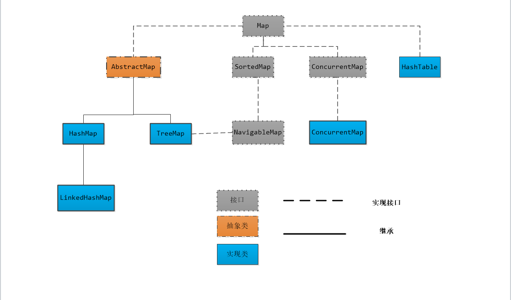
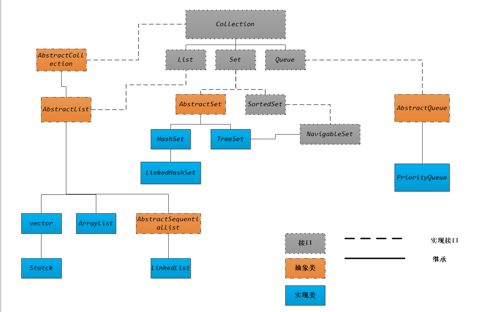
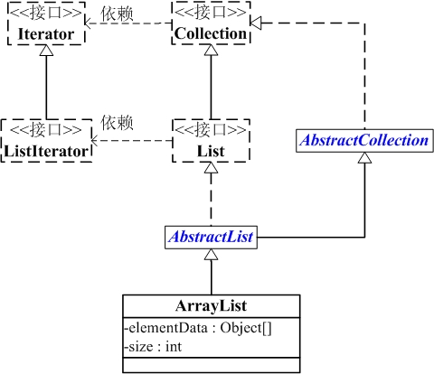
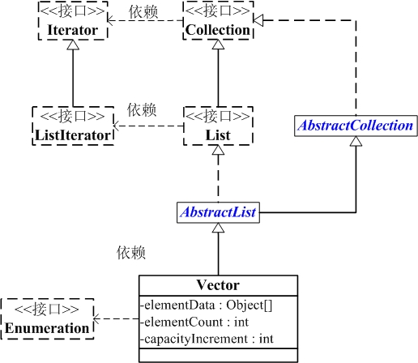
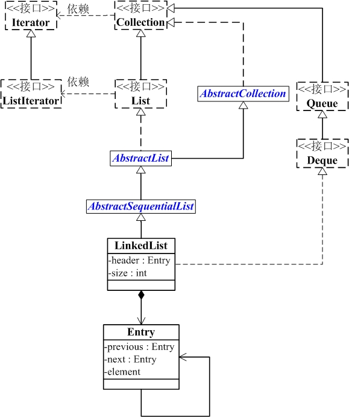
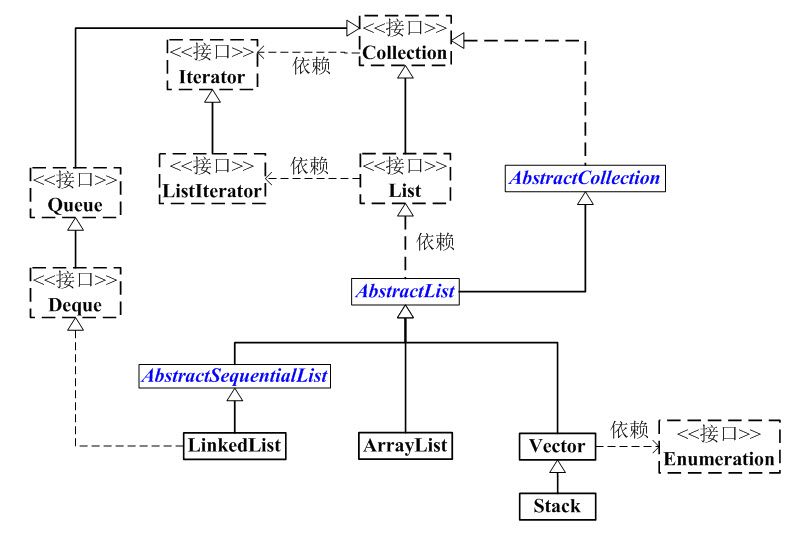
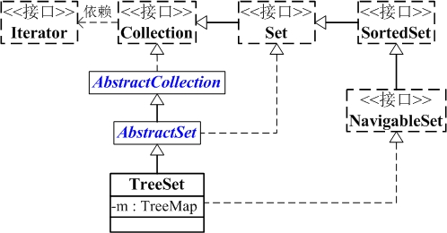

图中显示的依赖迭代器，并不意味着这个类型的对象可以使用迭代器方法，只是表示这个类在构建的时候使用到了迭代器的方法。

# Iterator

迭代器，所有的collection集合相关的类都可以使用迭代器遍历。着其中包括List、Set、Queue，迭代器Iterator是一个接口，它提供的常用的方法有：

```java
abstract boolean hasNext()
abstract E next()
abstract void remove()
```


## ListIterator

​	listIterator是一个接口，继承了Iterator接口。由于这个迭代器只适用于List接口的实现类，由list的特殊性，这个迭代器在list的基础上增加了许多方法：

​	在Iterator的基础上，新增的方法有：

```java
abstract void add(E object)
abstract boolean hasPrevious()
abstract int nextIndex()
abstract E previous()
abstract int previousIndex()
abstract void set(E object)
```

# Map

​	


1. Map是映射接口，Map中存储的内容是K-V对。
2. AbstractMap 是继承于Map的抽象类，它实现了Map中的大部分API。其它Map的实现类可以通过继承AbstractMap来减少重复编码。
3. SortedMap 是继承于Map的接口。SortedMap中的内容是排序的K-V对，排序的方法是通过比较器(Comparator)。
4. NavigableMap 是继承于SortedMap的接口，进一步，NavigableMap有一系列的与给出的K值比较的方法，比较常见的NavigableMap的实现类是TreeMap。
5. TreeMap 继承于AbstractMap，且实现了NavigableMap接口。因此，TreeMap中的内容是有序的K-V对，且有拥有比较K的方法。
6. HashMap 继承于AbstractMap，但没实现NavigableMap接口。因此，HashMap的内容是键值对，但不保证次序。
7. HashTable 虽然不是继承于AbstractMap，但它继承于Dictionary，Dictionary也是键值对的接口，而且也实现Map接口。因此，HashTable的内容也是键值对，也不保证次序。但和HashMap相比，HashTable是线程安全的，而且它支持通过Enumeration去遍历。
8. Map可以通过Collections.synchronizeMap，转换为一个线程安全的map。

```java
package com.company;

import java.util.Map;
import java.util.NavigableMap;
import java.util.TreeMap;

/**
 * @author thisxzj
 * @date 2019 2019-08-06 23:54
 */

public class NavigableMapTest {
    public static void main(String[] args) {
        NavigableMap<Integer, String> map = new TreeMap<>();
        for (int i = 0; i < 10; i++) {
            map.put(i, "No." + (10 - i));
        }
        Map.Entry<Integer, String> entry = map.higherEntry(5);
        System.out.println(entry.toString());
    }
}
```

```java
6=No.4

Process finished with exit code 0
```

1. 关于Map提供接口分别用于返回K集、V集或K-V映射集。
   1. entrySet()用于返回K-V（Map.Entry）集的Set集合
   2. keySet()用于返回K的Set集合
   3. values()用户返回V的Collection集合
2. 因为Map中不能包含重复的键；每个键最多只能映射到一个值。所以，K-V对集、K集都是Set，V集时Collection。
3. Map提供了“K-V对”、“根据K获取V”、“删除K”、“获取容量大小”等方法。

```java
package com.company;

import java.util.*;

/**
 * @author thisxzj
 * @date 2019 2019-08-07 00:09
 */


public class MapTest {
    public static void main(String[] args) {
        Map<Integer, String> map = new HashMap<>(16);
        final int LENGTH = 6;
        for (int i = 0; i < LENGTH; i++) {
            map.put(i, "No." + (LENGTH - i));
        }
        Set<Map.Entry<Integer, String>> entrySet = map.entrySet();
        Collection<String> values = map.values();

        Set<Integer> keys = map.keySet();
        for (Map.Entry entry : entrySet) {
            System.out.print(entry.toString() + " ");
        }

        System.out.print("\nkeys:\t");
        for (Integer k : keys) {
            System.out.print(k + "   \t");
        }

        System.out.print("\nvalues:\t");
        for (String v : values) {
            System.out.print(v + "\t");
        }

    }
}
```

```java
0=No.6 1=No.5 2=No.4 3=No.3 4=No.2 5=No.1 
keys:	  0   	1   	2   	3   	4   	5   	
values:	No.6	No.5	No.4	No.3	No.2	No.1	
Process finished with exit code 0
```


## SortedMap

SortedMap是一个继承于Map接口的接口。它是一个有序的SortedMap键值映射。SortedMap的排序方式有两种：自然排序 、 用户指定比较器原有的sortedMap附带。 

插入有序 SortedMap 的所有元素都必须实现 Comparable 接口（或者被指定的比较器所接受）。另外，所有SortedMap 实现类都应该提供 4 个标准构造方法：

1. 无参构造方法，它创建一个空的有序映射，按照键的自然顺序进行排序。
2.  Comparator参数的构造方法，它创建一个空的有序映射，根据指定的比较器进行排序。
3. Map参数的构造方法，创建一个包含map中的K-V对的有序映射，按照自然顺序进行排序。
4. SortedMap参数的构造方法，创建一个包含sortedMap中的K-V对的有序映射。排序方式和sortedMap的排序方式相同。

## NavigableMap

​	NavigableMap是继承于SortedMap的接口。它是一个可导航的键-值对集合，具有了为给定搜索目标报告最接近匹配项的导航方法。

1. 提供操作键-值对的方法。
   - lowerEntry、floorEntry、ceilingEntry 和 higherEntry 方法，它们分别返回与小于、小于等于、大于等于、大于给定K的K关联的 Map.Entry 对象。
   - firstEntry、pollFirstEntry、lastEntry 和 pollLastEntry 方法，它们返回和/或移除最小和最大的映射关系，否则返回 null。
   - 以上的操作均只针对刚好符合条件的第一个对象。
2. 提供操作键的方法。这个和第1类比较类似。
   - lowerKey、floorKey、ceilingKey 和 higherKey 方法，它们分别返回与小于、小于等于、大于等于、大于给定K的K值。
   - 以上的操作均只针对刚好符合条件的第一个对象。
3. 获取K集。
   - navigableKeySet、descendingKeySet分别获取正序/反序的K集。
4. 获取K-V对集的子集。
   - subMap方法获取获取给定的K的范围内的K-V对集的子集。

## AbstractMap

1. AbstractMap类提供 Map 接口的骨干实现，以最大限度地减少实现此接口所需的工作。
2. 要实现不可修改的映射，编程人员只需扩展此类并提供entrySet方法的实现即可，该方法将返回映射的映射关系 set 视图。
3. 通常，返回的 set 将依次在 AbstractSet 上实现。此 set 不支持 add() 或 remove() 方法，其迭代器也不支持 remove() 方法。
4. 要实现可修改的映射，编程人员必须另外重写此类的 put 方法（否则将抛出 UnsupportedOperationException），entrySet().iterator() 返回的迭代器也必须另外实现其 remove 方法。

AbstractMap实现了Map、接口中的大部分方法。而后添加了一个entrySet的方法。没有继承这个抽象类的HashTable没有这个方法。


### TreeMap

1. TreeMap 是一个有序的key-value集合，它是通过红黑树实现的。
2. TreeMap 继承于AbstractMap，所以它是一个Map，即一个key-value集合。
3. TreeMap 实现了NavigableMap接口，意味着它支持一系列的导航方法。
4. TreeMap 实现了Cloneable接口，意味着它能被克隆。
5. TreeMap 实现了java.io.Serializable接口，意味着它支持序列化。
6. TreeMap基于红黑树实现。该映射根据其键的自然顺序进行排序，或者根据创建映射时提供的 Comparator 进行排序，具体取决于使用的构造方法。
7. TreeMap的基本操作containsKey、get、put和remove的时间复杂度是 log(n) 。
8. TreeMap是非同步的，这意味着它不是线程安全的。

### HashMap

1. HashMap 是一个散列表，它存储的内容是键值对K-V对。
2. 继承于AbstractMap，实现了Map、Cloneable、java.io.Serializable接口。
3. HashMap的实现不是同步的，这意味着它不是线程安全的。
4. 它的key、value都可以为null。
5. HashMap中的映射不是有序的。

HashMap 的实例有两个参数影响其性能，初始容量和负载因子。

1. 容量是哈希表中桶的数量，初始容量 只是哈希表在创建时的容量。加载因子 是哈希表在其容量自动增加之前可以达到多满的一种尺度。当哈希表中的条目数超出了加载因子与当前容量的乘积时，则要对该哈希表进行rehash操作（即重建内部数据结构），从而哈希表将具有大约两倍的桶数。
2. 通常，默认负载因子是 0.75, 这是在时间和空间成本上寻求一种折衷。负载因子过高虽然减少了空间开销，但同时也增加了查询成本，在大多数 HashMap 类的操作中，包括get和put操作，都反映了这一点。在设置初始容量时应该考虑到映射中所需的条目数及其负载因子，以便最大限度地减少rehash操作次数。如果初始容量大于最大条目数除以负载因子，则不会发生rehash操作。

### LinkedHashMap

Map基本都可以使用HashMap，不过HashMap有一个问题，就是迭代HashMap的顺序并不是HashMap放置的顺序，也就是无序。HashMap的这一缺点往往会带来困扰，因为有些场景，我们期待一个有序的Map。

LinkedHashMap继承自HashMap。虽然增加了时间和空间上的开销，但是通过维护一个运行于所有条目的双向链表，LinkedHashMap保证了元素迭代的顺序。该迭代顺序可以是插入顺序或者是访问顺序。

1. LinkedHashMap的Key和Value都允许空。
2. LinkedHashMap是有序的。
3. LinkedHashMap不是线程安全的。

## HashTable

由于HashMap和HashTable的特殊关系，这里就只讨论二者区别以及HashTable的注意点。

不同点：

1. HashMap的K和V均可以为空，而Hashtable的K和V均不能为空。
2. HashMap不是线程安全的，而Hashtable是线程安全的。
3. 在单线程下，HashMap的性能要好于HashTable。

注意：

1. Hashtable适应synchronized进行同步，所以它线程安全的。
2. 在线程安全方面，ConcurrentHashMap是HashTable的替代，比HashTable的扩展性更好。
3. HashMap不能保证随着时间的推移Map中的元素次序是不变的。

# Collection



由于Collection实现了Iterator，所以collection所有的实现类的对象，都可以使用迭代器遍历。

所有的Collection的实现类的构造方法，都可以使用另一个Collection的对象作为参数添加进去，从而构造一个新的collection对象。也就是说，可以通过构造方法，可以将一个collection的对象，转化成另一种集合类对象。

```java
package com.xzj;

import java.awt.*;
import java.util.ArrayList;
import java.util.HashSet;
import java.util.Iterator;
import java.util.Set;

//   @ author :zjxu     time:2019-01-14
public class Main {
    public static void main(String[] args) {
        ArrayList<Point> arrayList = new ArrayList<>();
        arrayList.add(new Point(0, 3));
        arrayList.add(new Point(1, 2));

        Set<Point> set = new HashSet(arrayList);

        Iterator iterator = set.iterator();
        while (iterator.hasNext()) {
            System.out.println(iterator.next().toString());
        }
    }
}

```

## List 

1. list是一个接口，抽象类AbstractList实现了这个接口和AbstractCollection这个抽象类。
2. list是一个有序的队列 。其中的每一个元素都有自己的index，从’0’开始，依次增加。由于序列性，可以使用for-index遍历。
3. list中可以存在重复的元素。
4. list中允许使用空元素。

### ArrayList



1. ArrayList 是一个数组队列，相当于动态数组，与数组相比，它的容量能动态增长。
2. ArrayList 继承了AbstractList，实现了List。它是一个数组队列，提供了相关的添加、删除、修改、遍历等功能。
3. ArrayList实现了RandmoAccess接口，即提供了随机访问功能。在ArrayList中，我们即可以通过元素的index直接获取元素对象，这就是随机访问。
4. ArrayList 实现Serializable接口，这意味着ArrayList支持序列化，能通过序列化去传输。
5. ArrayList 实现了Cloneable接口，即覆盖了函数clone()，能被克隆。

//TODO — 20190807   01:25  —  go to sleep 

### Vector

​	

1. Vector是矢量队列，继承于AbstractList，实现了List, RandomAccess, Cloneable接口。
2. Vector的对象存储容器是对象数组，所以支持快速随机访问。
3. Vector 继承了AbstractList，实现了List。所以支持添加、删除、修改、遍历等功能。
4. Vector 实现了Cloneable接口，即实现clone()函数。它能被克隆。
5. 和ArrayList不同，Vector中的操作是线程安全的。

### LinkedList

​	


1. LinkedList 是一个继承于AbstractSequentialList的双向链表。
2. 可以被当作堆栈、队列或双端队列进行操作。
3. LinkedList 实现 List 接口，能对它进行队列操作。
4. LinkedList 实现 Deque 接口，即能将LinkedList当作双端队列使用
5. LinkedList 实现了Cloneable接口，即覆盖了函数clone()，能克隆。
6. LinkedList 实现Serializable接口，所以LinkedList支持序列化，能通过序列化去传输。
7. LinkedList 是非同步的，所以线程不安全。

LinkedList的本质是双向链表：

- header是双向链表的表头，它是双向链表节点所对应的类Entry的实例
- Entry中包含成员变量： previous, next, element。
  - previous是该节点的上一个节点，next是下一个节点，element是该节点所包含的值。 
- size是双向链表中节点的个数。
- LinkedList包含两个重要的成员：header 和 size。

### Stack


Stack是栈，特性是：先进后出，FILO。

继承于Vector，由于Vector是通过数组实现的，所以Stack也是通过数组实现的，而非链表。当然，我们也可以将LinkedList当作栈来使用。

### List总结



1. List 是一个接口，它继承于Collection的接口。它代表着有序的队列。
2. AbstractList 是一个抽象类，它继承于AbstractCollection。AbstractList实现List接口中除size()、get(int location)之外的函数。
3. AbstractSequentialList是一个抽象类，它继承于AbstractList，实现了“链表中，根据index索引值操作链表的全部函数”。
4. ArrayList, LinkedList, Vector, Stack是List的4个实现类。
5. ArrayList 是一个数组队列，相当于动态数组。它由数组实现，随机访问效率高，随机插入、随机删除效率低。
6. LinkedList 是一个双向链表。它也可以被当作堆栈、队列或双端队列进行操作。但LinkedList随机访问、随机插入、随机删除效率低。
7. Vector 是矢量队列，和ArrayList一样，它也是一个动态数组，由数组实现。但是ArrayList是非线程安全的，而Vector是线程安全的。
8. Stack 是栈，它继承于Vector。它的特性是：能快速的先进后出(FILO, First In Last Out)。

## Set


1. Set 是继承于Collection的接口。所有的set都是不允许有重复元素的集合。
2. AbstractSet 是一个抽象类，它继承于AbstractCollection
3. AbstractCollection实现了Set中的绝大部分函数，为Set的实现类提供了便利。
4. HastSet和TreeSet是Set的两个典型的实现类。
5. HashSet依赖于HashMap，它实际上是通过HashMap实现的。HashSet中的元素是无序的。
6. TreeSet依赖于TreeMap，它实际上是通过TreeMap实现的。TreeSet中的元素是有序的。	
7. Set都是线程不安全的。

### TreeSet



1. TreeSet 是一个有序的集合，它的作用是提供有序的Set集合。
2. 它继承于AbstractSet抽象类，实现了NavigableSet<E>, Cloneable, java.io.Serializable接口。
3. TreeSet 继承于AbstractSet，所以它是一个Set集合，具有Set的属性和方法。
4. TreeSet 实现了NavigableSet接口，意味着它支持一系列的导航方法。比如查找与指定目标最匹配项。
5. TreeSet 实现了Cloneable接口，意味着它能被克隆。
6. TreeSet 实现了java.io.Serializable接口，意味着它支持序列化。

在Set中，数据存储的结构是无序的。TreeSet对Set中的元素排序，由于TreeSet的有序性，所以TreeSet中不允许有空元素的存在。TreeSet中元素排序的方式有两种：自然排序和比较器排序。排序的结果的存储结构使用红黑树。

1. 自然排序方法要求添加进入set的元素自身实现Comparable接口，重写compareTo方法。按照compareTo规定的排序规则，来对添加进Set的元素排序。
2. 比较器排序的方法就是，编写一个比较器的对象，在初始化的时候，将其加载到TreeSet的构造函数中。这样，set中的元素就会按照比较器的规则来将插入set中的元素排序。

### HashSet


1. HashSet是一个没有重复元素的集合。
2. 它是由HashMap实现的，所以HashSet不保证元素的顺序。
3. HashSet允许使用null元素。
4. HashSet是非同步的。

### LinkedHashSet


1.  LinkedHashSet集合同样是根据元素的hashCode值来决定元素的存储位置，但是它同时使用链表维护元素的次序。
2. 这样使得元素看起来像是以插入顺序保存的，也就是说，当遍历该集合时候，LinkedHashSet将会以元素的添加顺序访问集合的元素。
3. 但是实际上，它的保存顺序是按照哈希码保存的。
4. 允许可以存在空元素，空元素的遍历顺序在最前。

### set总结

​	Set的结构图如下：


1. HashSet是无序的（按照hash顺序的，但是Hash是无序的）。
2. Tree是有序的，拥有自己的比较器或者是比较方法。
3. LinkedHashSet在HashSet的基础上，使用链表将HashSet中的元素连接起来，遍历顺序添加的顺序。

## Queue

​	Queue是一个接口，其下还有Deque、BlockingQueue、AbstractQueue接口。

结构图：


### PriorityQueue

1.  非线程安全，该线程安全版本为PriorityBlockingQueue。
2.  不允许使用非空元素。
3.  实际上是一个堆，默认为最小堆，也可以添加比较器。	
4. 新建对象的时候可以指定一个初始容量，其容量会自动增加。
5. 不允许使用 null 元素。
6. 对元素采用的是堆排序，迭代器只是对整个数组的依次遍历。

# 时间复杂度

| 数据结构   | 添加     | 查找     | 删除     | 随即存取 |
| ---------- | -------- | -------- | -------- | -------- |
| LinkedList | O(1)     | O(n)     | O(n)     | O(n)     |
| ArrayList  | O(1)     | O(n)     | O(n)     | O(1)     |
| HashMap    | O(1)     | O(1)     | O(1)     | -        |
| TreeMap    | O(log n) | O(log n) | O(log n) | -        |
| HashSet    | O(1)     | O(1)     | O(1)     | -        |
| TreeSet    | O(log n) | O(log n) | O(log n) | -        |
