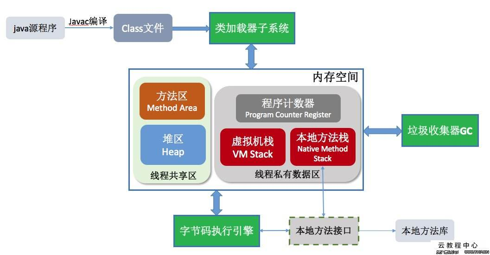

# Java内存结构图




其中共有资源是方法区和Java堆。线程私有的是本地方法栈和Java栈。

# 方法区

方法区(又叫做静态区)是所有线程共有的内存区域。方法区中保存的是所有的在程序中唯一的元素，包括类的信息（class）和运行时常量池。

## 类的信息

| 魔数         | 版本     | 常量池 | 访问标志 | 类索引   |
| ------------ | -------- | ------ | -------- | -------- |
| **父类索引** | **接口** | **域** | **方法** | **属性** |

### 魔数

magic：class文件的魔数为0xCAFEBABE，占两个字节。

### 版本

有两个版本号，次版本：minor_version、主版本：major_version。

minor_version：占两个字节。

major_version： 占两个字节。

### 常量池

**constant_pool_count**：常量池计数器统计常量池中量的数量。占两个字节。

**constant_pool**：常量池表用来存放常量。**是一张表**。

通常，常量池中的数据量是constant_pool_count - 1，在表中的第 0 位空出来，表示不对任何数据引用。

[常量池内部结构细讲](https://blog.csdn.net/wangtaomtk/article/details/52267548)

常量池中主要存放两大类常量，字面量和符号引用：

- 字面量包括：
  - 字符串
  - 被final修饰的值
  - 基本数据类型的值
  - 其他

*在类中定义的实例化对象由Java栈中的指针指向堆中。*

- 符号引用包含三类常量：
  - 类和数据结构的完全限定名
  - 字段的名称和描述符
  - 方法的名称和描述符

### 访问标志

**access_flags**：访问标志用于识别一些类或者接口层次的访问信息，占一个字节。

这个标志位通过设定如public、final、abstract等访问属性。

### 类索引、父类索引

**this_class：**类索引，用于确定这个类的全限定名，占两字节

**super_class：**父类索引。用于确定这个类父类的全限定名（Java语言不同意多重继承，故父类索引仅仅有一个。除了java.lang.Object类之外全部类都有父类，故除了java.lang.Object类之外，全部类该字段值都不为0），这个标志占两个字节。

### 接口

**interfaces_count：**接口索引计数器。占2字节。假设该类没有实现不论什么接口。则该计数器值为0，而且后面的接口的索引集合将不占用不论什么字节。

**interfaces：**接口索引集合，一组u2类型数据的集合。用来描写叙述这个类实现了哪些接口。这些被实现的接口将按implements语句后的接口顺序从左至右排列在接口的索引集合中（假设该类本身为接口，则为extends语句）。这个标志占两个字节。

### 域

字段表用于描写叙述接口或者类中声明的变量，包含类级变量和实例级变量(是否是static)。但不包含在方法内部声明的局部变量。

**fields_count：**字段表计数器：即字段表集合中的字段表数据个数。占2字节，其值为0x0001，即仅仅有一个字段表数据。也就是測试类中仅仅包括一个变量（不算方法内部变量）。

**fields：**字段表集合，一组字段表类型数据的集合。字段表用于描写叙述接口或类中声明的变量。包含类级别（static）和实例级别变量，不包含在方法内部声明的变量。

*字段表集合设定名称、作用域、变量类型以及是否带有下列：public、private、static、final、volatile、transient等属性。如果是存储在常量池中的类型，还会附带所存储的常量池的编号。*

### 方法

**methods_count**：方法表计数器，即方法表集合中的方法表数据个数。

占2字节，其值为0x0002，即測试类中有2个方法(还自己主动添加了一个构造函数）

**methods**：方法表集合，一组方法表类型数据的集合。

### 属性

在Class文件、属性表、方法表中都能够包括自己的属性表集合。用于描写叙述某些场景的专有信息。与Class文件里其他数据项对长度、顺序、格式的严格要求不同，属性表集合不要求当中包括的属性表具有严格的顺序，而且仅仅要属性的名称不与已有的属性名称反复。不论什么人实现的编译器可以向属性表中写入自定义的属性信息。虚拟机在执行时会忽略不能识别的属性，为了能正确解析Class文件，虚拟机规范中提前定义了虚拟机实现必须可以识别的9项属性：

| 属性名称           | 使用位置               | 含义                                   |
| ------------------ | ---------------------- | -------------------------------------- |
| Code               | 方法表                 | Java代码编译成的字节码指令             |
| ConstantValue      | 字段表                 | finalkeyword定义的常量值               |
| Deprecated         | 类文件、字段表、方法表 | 被声明为deprecated的方法和字段         |
| Exceptions         | 方法表                 | 方法抛出的异常                         |
| InnerClasses       | 类文件                 | 内部类列表                             |
| LineNumberTale     | Code属性               | Java源代码的行号与字节码指令的相应关系 |
| LocalVariableTable | Code属性               | 方法的局部变量描写叙述                 |
| SourceFile         | 类文件                 | 源文件名                               |
| Synthetic          | 类文件、方法表、字段表 | 标识方法或字段是由编译器自己主动生成的 |

每种属性均有各自的表结构。

## 运行时常量池

在方法区中有两个常量池：class文件中的静态常量池、和直接存储在方法区中的运行时常量池。那么运行时常量池是什么样子呢？

在class文件信息中的静态常量池中存放的各种字面量和符号引用被类加载之后存放到方法区的运行时常量池中。

运行时常量池在Java8之后从方法区，移动到堆区中。

**除了在编译期生成的常量，还允许动态生成，例如 String 类的 intern()。这部分常量也会被放入运行时常量池。**

也就是说运行时常量池中的元素的源头：

- 静态常量池存放到运行时常量池中

- 使用intern()等方法添加到运行时常量池中

这是一个通过字符串的程序，使用“ == ” 判断地址，从而分析常量池和运行时常量池的：

```java
package com.xzj;

//   @ author :zjxu     time:2019/1/10
public class Main {
    public static void main(String[] args) {
        // 1.编译期生成的各种字面量、符号引用
        String s1 = "xzj";
        String s2 = "xzj";

       // true:因为"abc"第一次出现将被放在运行时常量池中，后面再有相关变量需要使用，就直接指向它
        System.out.println(s1 == s2);
        
       //new会直接在java堆空间中创建对象
        String s3 = new String("xzj");
       
       //false，堆中和方法区的字符串的地址不相同
        System.out.println(s1 == s3);
       
       //2.运行期间新的常量
       //true:intern方法会把堆中字符串转移到运行时常量池中，并返回常量池中的引用
        String s4 = s3.intern();
        System.out.println(s1 == s4);
    }
}
```

# Java栈

## 栈帧

尽管这个内存区域叫做是Java栈，但是这里的栈并不是指的一个栈，而是每一个线程一个栈：每开启一个新的线程，Java虚拟机就会为它分配一个新的栈，方法就是这个栈的元素，这个特殊的元素叫做**栈帧**。调用方法就是入栈，方法return就是出栈（所以就可以理解递归的执行方式和栈溢出错误的意义）。

当所有方法都出栈了，那么这个线程就结束了。比如在，在main中开启了多个线程，main将多线程执行完毕了之后，main就会结束。但是由于在开启的其他的线程中，方法并没有结束，那些线程就会一致运行下去。

## 局部变量

Java的局部变量的作用规则和Java栈是直接相联系的。我们都知道，在Java中，定义在方法中的变量是局部变量。通过对栈的了解，我们知道Java栈只有在方法运行的时候才会存在在内存中，一旦方法结束，栈帧就会被pop出线程栈。那么，局部变量只有在方法运行的时候才有效这一点就很明显是正确的。

## 异常

该区域可能抛出以下异常：

1. 当线程请求的栈深度超过最大值，会抛出 StackOverflowError 异常；
2. 栈进行动态扩展时如果无法申请到足够内存，会抛出 OutOfMemoryError 异常。

## 栈上分配

小的对象可以直接在栈上分配，这样可以减小GC的的压力。

# Java堆

## 内存分配

Java堆是Java虚拟机中最重要的部分之一。所有对象实例都在这里分配内存。是垃圾收集的主要区域（"GC 堆 "），现代的垃圾收集器基本都是采用分代收集算法，该算法的思想是针对不同的对象采取不同的垃圾回收算法，因此虚拟机把 Java 堆分成以下三块：

- 新生代（Young Generation）
  - Eden
  - From From Survivor
  - To Survivor
- 老年代（Old Generation）
- 永久代（Permanent Generation）

当一个对象被创建时，它首先进入新生代，之后有可能被转移到老年代中。新生代存放着大量的生命很短的对象，故新生代在三个区域中垃圾回收的频率最高。

为了更高效地进行垃圾回收，把新生代继续划分成以下三个空间：Eden、From、To。

## 对象访问方式

### 句柄访问方式


句柄访问方式：方法中的对象指针指向堆中的一个存放对象的一个数据结构中。在这个数据结构中，包含两种指针：指向堆中的实例数据的指针和指向类的类型数据的指针。将这两个指针所指向的数据结合起来就是一个完整的累的实例化对象数据。

### 指针访问方式


指针访问方式：方法中的对象指针指向堆中的一个存放对象的一个数据结构中。在这个数据结构中，这个数据结构就是这个类的实例化对象的数据，在这个对象数据中，还有一个指针，这个指针用来获取方法区中的对象类型数据。

*通常来说使用的是第二种。*

# 本地方法栈

本地方法不是用 Java 实现，对待这些方法需要特别处理。与 Java 虚拟机栈类似，它们之间的区别只不过是本地方法栈为本地方法服务。

# 程序计数器

程序计数器用来记录正在执行的虚拟机字节码指令的地址（如果正在执行的是本地方法则为空）。


