图中显示的依赖迭代器，并不意味着这个类型的对象可以使用迭代器方法，只是表示这个类在构建的时候使用到了迭代器的方法。

# Iterator

迭代器，所有的collection集合相关的类都可以使用迭代器遍历。着其中包括List、Set、Queue，迭代器Iterator是一个接口，它提供的常用的方法有：

```java
abstract boolean hasNext()
abstract E next()
abstract void remove()
```


## ListIterator

​	listIterator是一个接口，继承了Iterator接口。由于这个迭代器只适用于List接口的实现类，由list的特殊性，这个迭代器在list的基础上增加了许多方法：

​	在Iterator的基础上，新增的方法有：

```java
abstract void add(E object)
abstract boolean hasPrevious()
abstract int nextIndex()
abstract E previous()
abstract int previousIndex()
abstract void set(E object)
```

# Map

​	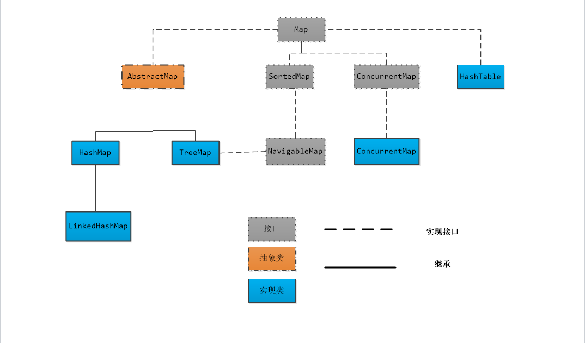


1. Map是映射接口，Map中存储的内容是K-V对。
2. AbstractMap 是继承于Map的抽象类，它实现了Map中的大部分API。其它Map的实现类可以通过继承AbstractMap来减少重复编码。
3. SortedMap 是继承于Map的接口。SortedMap中的内容是排序的K-V对，排序的方法是通过比较器(Comparator)。
4. NavigableMap 是继承于SortedMap的接口，进一步，NavigableMap有一系列的与给出的K值比较的方法，比较常见的NavigableMap的实现类是TreeMap。
5. TreeMap 继承于AbstractMap，且实现了NavigableMap接口。因此，TreeMap中的内容是有序的K-V对，且有拥有比较K的方法。
6. HashMap 继承于AbstractMap，但没实现NavigableMap接口。因此，HashMap的内容是键值对，但不保证次序。
7. HashTable 虽然不是继承于AbstractMap，但它继承于Dictionary，Dictionary也是键值对的接口，而且也实现Map接口。因此，HashTable的内容也是键值对，也不保证次序。但和HashMap相比，HashTable是线程安全的，而且它支持通过Enumeration去遍历。
8. Map可以通过Collections.synchronizeMap，转换为一个线程安全的map。

```java
package com.company;

import java.util.Map;
import java.util.NavigableMap;
import java.util.TreeMap;

/**
 * @author thisxzj
 * @date 2019 2019-08-06 23:54
 */

public class NavigableMapTest {
    public static void main(String[] args) {
        NavigableMap<Integer, String> map = new TreeMap<>();
        for (int i = 0; i < 10; i++) {
            map.put(i, "No." + (10 - i));
        }
        Map.Entry<Integer, String> entry = map.higherEntry(5);
        System.out.println(entry.toString());
    }
}
```

```java
6=No.4

Process finished with exit code 0
```

1. 关于Map提供接口分别用于返回K集、V集或K-V映射集。
   1. entrySet()用于返回K-V（Map.Entry）集的Set集合
   2. keySet()用于返回K的Set集合
   3. values()用户返回V的Collection集合
2. 因为Map中不能包含重复的键；每个键最多只能映射到一个值。所以，K-V对集、K集都是Set，V集时Collection。
3. Map提供了“K-V对”、“根据K获取V”、“删除K”、“获取容量大小”等方法。

```java
package com.company;

import java.util.*;

/**
 * @author thisxzj
 * @date 2019 2019-08-07 00:09
 */


public class MapTest {
    public static void main(String[] args) {
        Map<Integer, String> map = new HashMap<>(16);
        final int LENGTH = 6;
        for (int i = 0; i < LENGTH; i++) {
            map.put(i, "No." + (LENGTH - i));
        }
        Set<Map.Entry<Integer, String>> entrySet = map.entrySet();
        Collection<String> values = map.values();

        Set<Integer> keys = map.keySet();
        for (Map.Entry entry : entrySet) {
            System.out.print(entry.toString() + " ");
        }

        System.out.print("\nkeys:\t");
        for (Integer k : keys) {
            System.out.print(k + "   \t");
        }

        System.out.print("\nvalues:\t");
        for (String v : values) {
            System.out.print(v + "\t");
        }

    }
}
```

```java
0=No.6 1=No.5 2=No.4 3=No.3 4=No.2 5=No.1 
keys:	  0   	1   	2   	3   	4   	5   	
values:	No.6	No.5	No.4	No.3	No.2	No.1	
Process finished with exit code 0
```


## SortedMap

SortedMap是一个继承于Map接口的接口。它是一个有序的SortedMap键值映射。SortedMap的排序方式有三种：自然排序 、 用户指定比较器、原有的sortedMap附带。 

插入有序 SortedMap 的所有元素都必须实现 Comparable 接口（或者被指定的比较器所接受）。另外，所有SortedMap 实现类都应该提供 4 个标准构造方法：

1. 无参构造方法，它创建一个空的有序映射，按照键的自然顺序进行排序。
2.  Comparator参数的构造方法，它创建一个空的有序映射，根据指定的比较器进行排序。
3. Map参数的构造方法，创建一个包含map中的K-V对的有序映射，按照自然顺序进行排序。
4. SortedMap参数的构造方法，创建一个包含sortedMap中的K-V对的有序映射。排序方式和sortedMap的排序方式相同。

## NavigableMap

​	NavigableMap是继承于SortedMap的接口。它是一个可导航的键-值对集合，具有了为给定搜索目标报告最接近匹配项的导航方法。

1. 提供操作键-值对的方法。
   - lowerEntry、floorEntry、ceilingEntry 和 higherEntry 方法，它们分别返回与小于、小于等于、大于等于、大于给定K的K关联的 Map.Entry 对象。
   - firstEntry、pollFirstEntry、lastEntry 和 pollLastEntry 方法，它们返回和/或移除最小和最大的映射关系，否则返回 null。
   - 以上的操作均只针对刚好符合条件的第一个对象。
2. 提供操作键的方法。这个和第1类比较类似。
   - lowerKey、floorKey、ceilingKey 和 higherKey 方法，它们分别返回与小于、小于等于、大于等于、大于给定K的K值。
   - 以上的操作均只针对刚好符合条件的第一个对象。
3. 获取K集。
   - navigableKeySet、descendingKeySet分别获取正序/反序的K集。
4. 获取K-V对集的子集。
   - subMap方法获取获取给定的K的范围内的K-V对集的子集。

## AbstractMap

1. AbstractMap类提供 Map 接口的骨干实现，以最大限度地减少实现此接口所需的工作。
2. 要实现不可修改的映射，编程人员只需扩展此类并提供entrySet方法的实现即可，该方法将返回映射的映射关系 set 视图。
3. 通常，返回的 set 将依次在 AbstractSet 上实现。此 set 不支持 add() 或 remove() 方法，其迭代器也不支持 remove() 方法。
4. 要实现可修改的映射，编程人员必须另外重写此类的 put 方法（否则将抛出 UnsupportedOperationException），entrySet().iterator() 返回的迭代器也必须另外实现其 remove 方法。

AbstractMap实现了Map、接口中的大部分方法。而后添加了一个entrySet的方法。没有继承这个抽象类的HashTable没有这个方法。


### TreeMap

1. TreeMap 是一个有序的key-value集合，它是通过红黑树实现的。
2. TreeMap 继承于AbstractMap，所以它是一个Map，即一个key-value集合。
3. TreeMap 实现了NavigableMap接口，意味着它支持一系列的导航方法。
4. TreeMap 实现了Cloneable接口，意味着它能被克隆。
5. TreeMap 实现了java.io.Serializable接口，意味着它支持序列化。
6. TreeMap基于红黑树实现。该映射根据其键的自然顺序进行排序，或者根据创建映射时提供的 Comparator 进行排序，具体取决于使用的构造方法。
7. TreeMap的基本操作containsKey、get、put和remove的时间复杂度是 log(n) 。
8. TreeMap是非同步的，这意味着它不是线程安全的。

### HashMap

1. HashMap 是一个散列表，它存储的内容是键值对K-V对。
2. 继承于AbstractMap，实现了Map、Cloneable、java.io.Serializable接口。
3. HashMap的实现不是同步的，这意味着它不是线程安全的。
4. 它的key、value都可以为null。
5. HashMap中的映射不是有序的。

HashMap 的实例有两个参数影响其性能，初始容量和负载因子。

1. 容量是哈希表中桶的数量，初始容量 只是哈希表在创建时的容量。加载因子 是哈希表在其容量自动增加之前可以达到多满的一种尺度。当哈希表中的条目数超出了加载因子与当前容量的乘积时，则要对该哈希表进行rehash操作（即重建内部数据结构），从而哈希表将具有大约两倍的桶数。
2. 通常，默认负载因子是 0.75, 这是在时间和空间成本上寻求一种折衷。负载因子过高虽然减少了空间开销，但同时也增加了查询成本，在大多数 HashMap 类的操作中，包括get和put操作，都反映了这一点。在设置初始容量时应该考虑到映射中所需的条目数及其负载因子，以便最大限度地减少rehash操作次数。如果初始容量大于最大条目数除以负载因子，则不会发生rehash操作。

HashMap的数组的扩容：

1. 已经被使用的数组的数量与总的数组的数量的比值超过了设定的负载因子通常是0.75，那么这样的情况下，需要对数组进行扩容。
2. 当下挂链表的数量达到七个的时候，这个时候有两种情况，在底层的数组的size小于64的时候，进行数组翻倍扩容。

HashMap的树化和链化：

1. 当下挂链表的数量达到七个的时候，这个时候有两种情况，在底层数组的size大于等于64的时候，将下挂的链表红黑树化。
2. 当红黑树的节点的数量减少到6个的时候，对这个红黑树进行链化。

hash冲突的解决方法：

比较出名的有四种

1. 开放定址法

   当冲突发生时，使用某种探测技术在散列表中形成一个探测序列。沿此序列逐个单元地查找，直到找到给定的关键字，或者碰到一个开放的地址（即该地址单元为空）为止（若要插入，在探查到开放的地址，则可将待插入的新结点存人该地址单元）。查找时探测到开放的地址则表明表中无待查的关键字，即查找失败。

2. 拉链法

   链化和树化都是链地址法。

3. 再哈希法

   数组扩容然后转移部分的对象就是rehash法。

4. 公共溢出区域法

   建立一个公共溢出区域，就是把冲突的都放在另一个地方，不在表里面。

HashMap的并发问题：

1. 多线程扩容，引起的死循环问题 

   在数组扩容、rehash的过程中，可能导致链表成环。

2. 多线程put的时候可能导致元素丢失 

   链表或者是树的节点后添加，并发情况下如果在同一个位置添加，只会有一个添加成功。

3. put非null元素后get出来的却是null

一般用什么作为HashMap的key：

使用不可变类：String、Integer等数字类型。


### LinkedHashMap

Map基本都可以使用HashMap，不过HashMap有一个问题，就是迭代HashMap的顺序并不是HashMap放置的顺序，也就是无序。HashMap的这一缺点往往会带来困扰，因为有些场景，我们期待一个有序的Map。

LinkedHashMap继承自HashMap。虽然增加了时间和空间上的开销，但是通过维护一个运行于所有条目的双向链表，LinkedHashMap保证了元素迭代的顺序。该迭代顺序可以是插入顺序或者是访问顺序。

1. LinkedHashMap的Key和Value都允许空。
2. LinkedHashMap是有序的。
3. LinkedHashMap不是线程安全的。

## HashTable

由于HashMap和HashTable的特殊关系，这里就只讨论二者区别以及HashTable的注意点。

不同点：

1. HashMap的K和V均可以为空，而Hashtable的K和V均不能为空。
2. HashMap不是线程安全的，而Hashtable是线程安全的。
3. 在单线程下，HashMap的性能要好于HashTable。

注意：

1. Hashtable适应synchronized进行同步，所以它线程安全的。
2. 在线程安全方面，ConcurrentHashMap是HashTable的替代，比HashTable的扩展性更好。
3. HashMap不能保证随着时间的推移Map中的元素次序是不变的。

# Collection

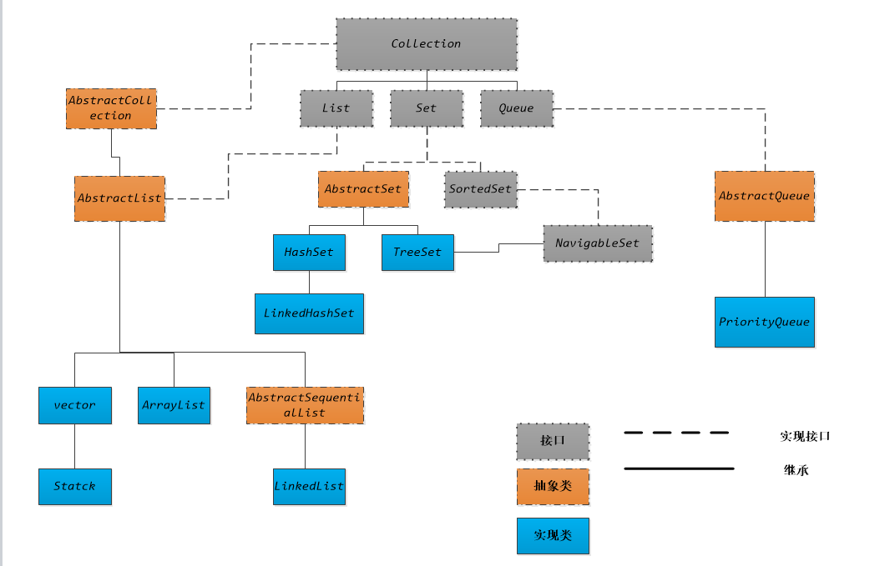

由于Collection实现了Iterator，所以collection所有的实现类的对象，都可以使用迭代器遍历。

所有的Collection的实现类的构造方法，都可以使用另一个Collection的对象作为参数添加进去，从而构造一个新的collection对象。也就是说，可以通过构造方法，可以将一个collection的对象，转化成另一种集合类对象。

```java
package com.xzj;

import java.awt.*;
import java.util.ArrayList;
import java.util.HashSet;
import java.util.Iterator;
import java.util.Set;

//   @ author :zjxu     time:2019-01-14
public class Main {
    public static void main(String[] args) {
        ArrayList<Point> arrayList = new ArrayList<>();
        arrayList.add(new Point(0, 3));
        arrayList.add(new Point(1, 2));

        Set<Point> set = new HashSet(arrayList);

        Iterator iterator = set.iterator();
        while (iterator.hasNext()) {
            System.out.println(iterator.next().toString());
        }
    }
}

```

## List 

1. list是一个接口，抽象类AbstractList实现了这个接口和AbstractCollection这个抽象类。
2. list是一个有序的队列 。其中的每一个元素都有自己的index，从’0’开始，依次增加。由于序列性，可以使用for-index遍历。
3. list中可以存在重复的元素。
4. list中允许使用空元素。

### ArrayList

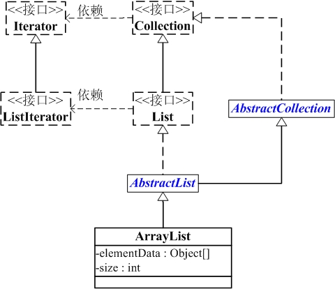

1. ArrayList 是一个数组队列，相当于动态数组，与数组相比，它的容量能动态增长。
2. ArrayList 继承了AbstractList，实现了List。它是一个数组队列，提供了相关的添加、删除、修改、遍历等功能。
3. ArrayList实现了RandmoAccess接口，即提供了随机访问功能。在ArrayList中，我们即可以通过元素的index直接获取元素对象，这就是随机访问。
4. ArrayList 实现Serializable接口，这意味着ArrayList支持序列化，能通过序列化去传输。
5. ArrayList 实现了Cloneable接口，即覆盖了函数clone()，能被克隆。

//TODO — 20190807   01:25  —  go to sleep 

### Vector

​	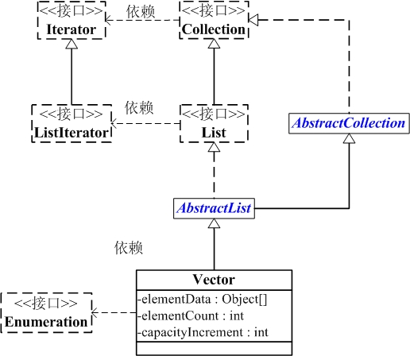

1. Vector是矢量队列，继承于AbstractList，实现了List, RandomAccess, Cloneable接口。
2. Vector的对象存储容器是对象数组，所以支持快速随机访问。
3. Vector 继承了AbstractList，实现了List。所以支持添加、删除、修改、遍历等功能。
4. Vector 实现了Cloneable接口，即实现clone()函数。它能被克隆。
5. 和ArrayList不同，Vector中的操作是线程安全的。

### LinkedList

​	


1. LinkedList 是一个继承于AbstractSequentialList的双向链表。
2. 可以被当作堆栈、队列或双端队列进行操作。
3. LinkedList 实现 List 接口，能对它进行队列操作。
4. LinkedList 实现 Deque 接口，即能将LinkedList当作双端队列使用
5. LinkedList 实现了Cloneable接口，即覆盖了函数clone()，能克隆。
6. LinkedList 实现Serializable接口，所以LinkedList支持序列化，能通过序列化去传输。
7. LinkedList 是非同步的，所以线程不安全。

LinkedList的本质是双向链表：

- header是双向链表的表头，它是双向链表节点所对应的类Entry的实例
- Entry中包含成员变量： previous, next, element。
  - previous是该节点的上一个节点，next是下一个节点，element是该节点所包含的值。 
- size是双向链表中节点的个数。
- LinkedList包含两个重要的成员：header 和 size。

### Stack

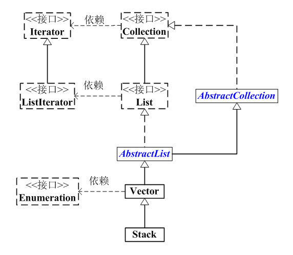

Stack是栈，特性是：先进后出，FILO。

继承于Vector，由于Vector是通过数组实现的，所以Stack也是通过数组实现的，而非链表。当然，我们也可以将LinkedList当作栈来使用。

### List总结

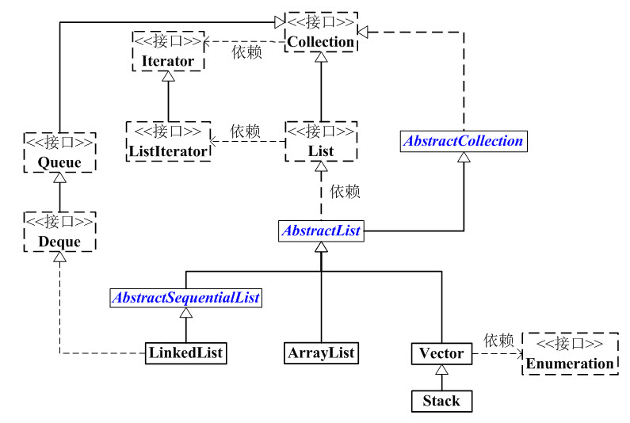

1. List 是一个接口，它继承于Collection的接口。它代表着有序的队列。
2. AbstractList 是一个抽象类，它继承于AbstractCollection。AbstractList实现List接口中除size()、get(int location)之外的函数。
3. AbstractSequentialList是一个抽象类，它继承于AbstractList，实现了“链表中，根据index索引值操作链表的全部函数”。
4. ArrayList, LinkedList, Vector, Stack是List的4个实现类。
5. ArrayList 是一个数组队列，相当于动态数组。它由数组实现，随机访问效率高，随机插入、随机删除效率低。
6. LinkedList 是一个双向链表。它也可以被当作堆栈、队列或双端队列进行操作。但LinkedList随机访问、随机插入、随机删除效率低。
7. Vector 是矢量队列，和ArrayList一样，它也是一个动态数组，由数组实现。但是ArrayList是非线程安全的，而Vector是线程安全的。
8. Stack 是栈，它继承于Vector。它的特性是：能快速的先进后出(FILO, First In Last Out)。

## Set

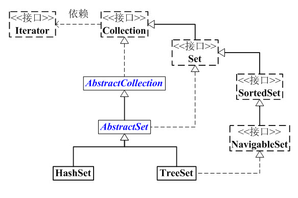

1. Set 是继承于Collection的接口。所有的set都是不允许有重复元素的集合。
2. AbstractSet 是一个抽象类，它继承于AbstractCollection
3. AbstractCollection实现了Set中的绝大部分函数，为Set的实现类提供了便利。
4. HastSet和TreeSet是Set的两个典型的实现类。
5. HashSet依赖于HashMap，它实际上是通过HashMap实现的。HashSet中的元素是无序的。
6. TreeSet依赖于TreeMap，它实际上是通过TreeMap实现的。TreeSet中的元素是有序的。	
7. Set都是线程不安全的。

### TreeSet

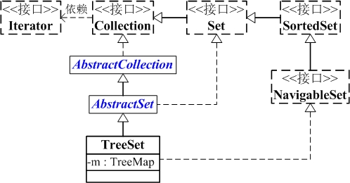

1. TreeSet 是一个有序的集合，它的作用是提供有序的Set集合。
2. 它继承于AbstractSet抽象类，实现了NavigableSet<E>, Cloneable, java.io.Serializable接口。
3. TreeSet 继承于AbstractSet，所以它是一个Set集合，具有Set的属性和方法。
4. TreeSet 实现了NavigableSet接口，意味着它支持一系列的导航方法。比如查找与指定目标最匹配项。
5. TreeSet 实现了Cloneable接口，意味着它能被克隆。
6. TreeSet 实现了java.io.Serializable接口，意味着它支持序列化。

在Set中，数据存储的结构是无序的。TreeSet对Set中的元素排序，由于TreeSet的有序性，所以TreeSet中不允许有空元素的存在。TreeSet中元素排序的方式有两种：自然排序和比较器排序。排序的结果的存储结构使用红黑树。

1. 自然排序方法要求添加进入set的元素自身实现Comparable接口，重写compareTo方法。按照compareTo规定的排序规则，来对添加进Set的元素排序。
2. 比较器排序的方法就是，编写一个比较器的对象，在初始化的时候，将其加载到TreeSet的构造函数中。这样，set中的元素就会按照比较器的规则来将插入set中的元素排序。

### HashSet

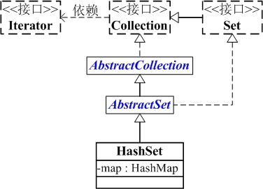


1. HashSet是一个没有重复元素的集合。
2. 它是由HashMap实现的，所以HashSet不保证元素的顺序。
3. HashSet允许使用null元素。
4. HashSet是非同步的。

### LinkedHashSet


1.  LinkedHashSet集合同样是根据元素的hashCode值来决定元素的存储位置，但是它同时使用链表维护元素的次序。
2. 这样使得元素看起来像是以插入顺序保存的，也就是说，当遍历该集合时候，LinkedHashSet将会以元素的添加顺序访问集合的元素。
3. 但是实际上，它的保存顺序是按照哈希码保存的。
4. 允许可以存在空元素，空元素的遍历顺序在最前。

### set总结

​	Set的结构图如下：


1. HashSet是无序的（按照hash顺序的，但是Hash是无序的）。
2. Tree是有序的，拥有自己的比较器或者是比较方法。
3. LinkedHashSet在HashSet的基础上，使用链表将HashSet中的元素连接起来，遍历顺序添加的顺序。

## Queue

​	Queue是一个接口，其下还有Deque、BlockingQueue、AbstractQueue接口。

结构图：

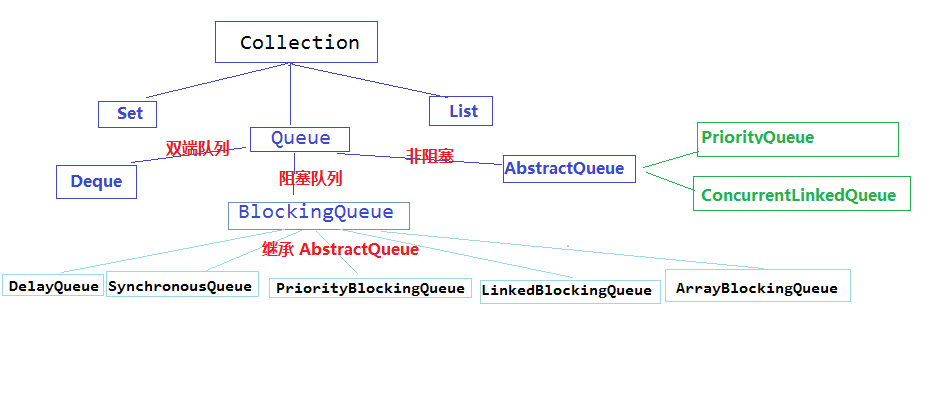

### PriorityQueue

1.  非线程安全，该线程安全版本为PriorityBlockingQueue。
2.  不允许使用非空元素。
3.  实际上是一个堆，默认为最小堆，也可以添加比较器。	
4. 新建对象的时候可以指定一个初始容量，其容量会自动增加。
5. 不允许使用 null 元素。
6. 对元素采用的是堆排序，迭代器只是对整个数组的依次遍历。

# ConcurrentHashMap

## 1.7

在1.7中，使用的是Segment` + `HashEntry的方式实现的。

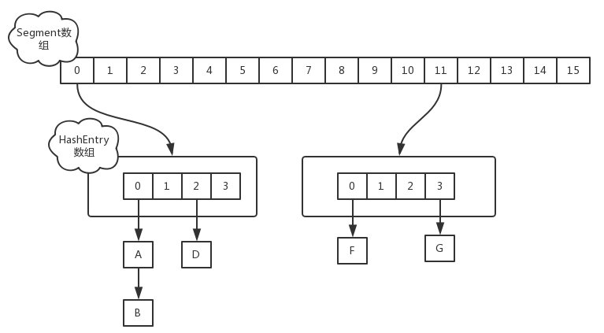

### put实现

当执行`put`方法插入数据时，根据key的hash值，在`Segment`数组中找到相应的位置，如果相应位置的`Segment`还未初始化，则通过CAS进行赋值，接着执行`Segment`对象的`put`方法通过加锁机制插入数据，线程A和线程B同时执行相同`Segment`对象的`put`方法

1. 线程A执行`tryLock()`方法成功获取锁，则把`HashEntry`对象插入到相应的位置。
2. 线程B获取锁失败，则执行`scanAndLockForPut()`方法，在`scanAndLockForPut`方法中，会通过重复执行`tryLock()`方法尝试获取锁，在多处理器环境下，重复次数为64，单处理器重复次数为1，当执行`tryLock()`方法的次数超过上限时，则执行`lock()`方法挂起线程B。
3. 当线程A执行完插入操作时，会通过`unlock()`方法释放锁，接着唤醒线程B继续执行。

### size实现

因为`ConcurrentHashMap`是可以并发插入数据的，所以在准确计算元素时存在一定的难度，一般的思路是统计每个`Segment`对象中的元素个数，然后进行累加，但是这种方式计算出来的结果并不一样的准确的，因为在计算后面几个`Segment`的元素个数时，已经计算过的`Segment`同时可能有数据的插入或则删除，在1.7的实现中，先采用不加锁的方式，连续计算元素的个数，最多计算3次：

1. 如果前后两次计算结果相同，则说明计算出来的元素个数是准确的。
2. 如果前后两次计算结果都不同，则给每个`Segment`进行加锁，再计算一次元素的个数。

## 1.8

1.8中放弃了`Segment`臃肿的设计，取而代之的是采用`Node` + `CAS` + `Synchronized`来保证并发安全进行实现，结构如下：

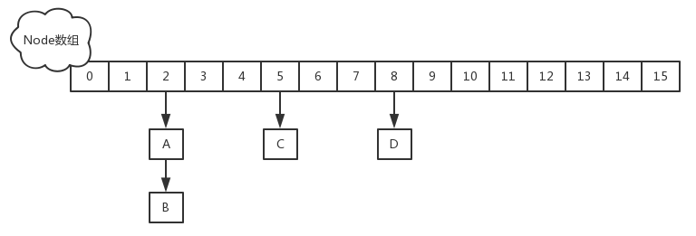

### put实现

当执行`put`方法插入数据时，根据key的hash值，在`Node`数组中找到相应的位置，实现如下：

1. 如果相应位置的`Node`还未初始化，则通过CAS插入相应的数据。
2. 如果相应位置的`Node`不为空，且当前该节点不处于移动状态，则对该节点加`synchronized`锁，如果该节点的`hash`不小于0，则遍历链表更新节点或插入新节点。
3. 如果该节点是`TreeBin`类型的节点，说明是红黑树结构，则通过`putTreeVal`方法往红黑树中插入节点。
4. 如果`binCount`不为0，说明`put`操作对数据产生了影响，如果当前链表的个数达到8个，则通过`treeifyBin`方法转化为红黑树，如果`oldVal`不为空，说明是一次更新操作，没有对元素个数产生影响，则直接返回旧值。
5. 如果插入的是一个新节点，则执行`addCount()`方法尝试更新元素个数`baseCount`。

### size实现

1.8中使用一个`volatile`类型的变量`baseCount`记录元素的个数，当插入新数据或则删除数据时，会通过`addCount()`方法更新`baseCount`。

1. 初始化时`counterCells`为空，在并发量很高时，如果存在两个线程同时执行`CAS`修改`baseCount`值，则失败的线程会继续执行方法体中的逻辑，使用`CounterCell`记录元素个数的变化。
2. 如果`CounterCell`数组`counterCells`为空，调用`fullAddCount()`方法进行初始化，并插入对应的记录数，通过`CAS`设置cellsBusy字段，只有设置成功的线程才能初始化`CounterCell`数组。
3. 如果通过`CAS`设置cellsBusy字段失败的话，则继续尝试通过`CAS`修改`baseCount`字段，如果修改`baseCount`字段成功的话，就退出循环，否则继续循环插入`CounterCell`对象，所以在1.8中的`size`实现比1.7简单多，因为元素个数保存`baseCount`中，部分元素的变化个数保存在`CounterCell`数组中，通过累加`baseCount`和`CounterCell`数组中的数量，即可得到元素的总个数。

# 时间复杂度

| 数据结构   | 添加     | 查找     | 删除     | 随即存取 |
| ---------- | -------- | -------- | -------- | -------- |
| LinkedList | O(1)     | O(n)     | O(n)     | O(n)     |
| ArrayList  | O(1)     | O(n)     | O(n)     | O(1)     |
| HashMap    | O(1)     | O(1)     | O(1)     | -        |
| TreeMap    | O(log n) | O(log n) | O(log n) | -        |
| HashSet    | O(1)     | O(1)     | O(1)     | -        |
| TreeSet    | O(log n) | O(log n) | O(log n) | -        |
