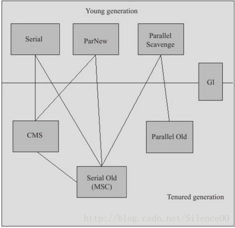
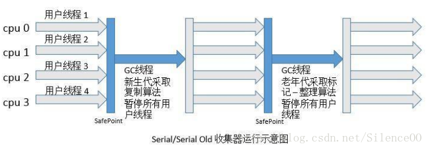
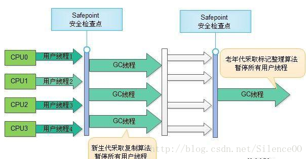
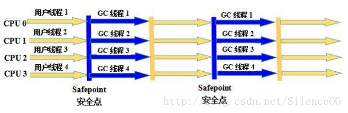
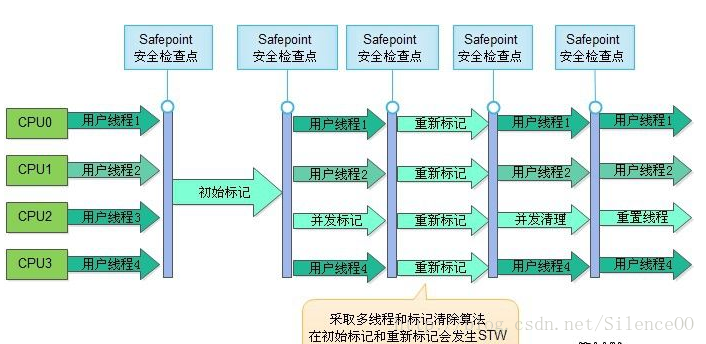
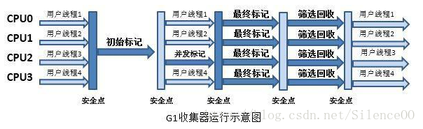

# 垃圾收集算法

## 确定垃圾

### 引用计数法

#### 方法

引用计数是垃圾收集器中的早期策略。在这种方法中，堆中每个对象实例都有一个引用计数。当一个对象被创建时，且将该对象实例分配给一个变量，该变量计数设置为1。当任何其它变量被赋值为这个对象的引用时，计数加1（a = b,则b引用的对象实例的计数器+1），但当一个对象实例的某个引用超过了生命周期或者被设置为一个新值时，对象实例的引用计数器减1。任何引用计数器为0的对象实例可以被当作垃圾收集。当一个对象实例被垃圾收集时，它引用的任何对象实例的引用计数器减1。

#### 优缺点	

优点：执行速度快，对程序的打扰比较小。

缺点：无法发现两个垃圾对象相互引用的问题。

### 可达性分析

#### 方法

从根区域开始搜索有引用的对象，一旦某个对象被确定被引用了，那么就确定这个对象不是垃圾。然后再搜索这个对象引用了哪些对象，直到最后。从根本的区域出发，没有被引用的对象就会被标记为垃圾。

GC root

1. 虚拟机（JVM）栈中引用对象
2. 方法区中的类静态属性引用对象
3. 方法区中常量引用的对象（final 的常量值）
4. 
   本地方法栈JNI的引用对象

解决了垃圾对象之间相互引用的问题。

## 标记清除法

### 方法

从在确定了哪些事垃圾之后，对垃圾对象进行清理。由于清理之后的区域并不连续，会造成内存碎片，可能无法分配大的对象。

### 优缺点

缺点：造成内存碎片。

## 标记整理法

### 方法

标记-整理算法采用标记-清除算法一样的方式进行对象的标记，但在清除时不同，在回收不存活的对象占用的空间后，会将所有的存活对象往左端空闲空间移动，并更新对应的指针。标记-整理算法是在标记-清除算法的基础上，又进行了对象的移动，因此成本更高，但是却解决了内存碎片的问题。

### 优缺点

优点：解决了标记清除法产生的内存碎片的问题。

缺点：需要进行移动，代价稍大。

## 复制算法

复制算法可以将内存按照容量划分为大小相同的两块，每次只使用一块，当这块内存用完后，会将还存活的对象另一块等大的内存中，最后再把已使用过的内存空间清理掉。这样每次都只会对半个内存回收，分配时不需要考虑内存空间碎片等问题。但这样的代价就是牺牲了一半的内存，成本太高。

## 分代收集算法

将整个Java堆分为三个部分，其中保存着存活时间不一样长的对象。分别分为年轻代、年老代、持久代。

### 年轻代

刚刚new出来的对象都是保存在年轻代中的。年轻代的目的就是快速收集生命时间短的对象，但是在一个对象刚刚被new出来的时候，并不知道这个对象的生命时间的长度。在这样的条件下，在通常的情况下我们在新生代中使用复制算法。将年轻代按照8:1:1的比例依次分为了三个部分，是对复制算法的一种优化方式这样就只会浪费很小的一部分空间：

- Eden
- To Survivor
- From Survivor	

1. 一个对象被new出来之后，被放置在Eden中，在下一个垃圾收集操作来来临之前，大多数的类都会死掉，然后被收集。下一次垃圾收集操作的发生条件是Eden满或者是到达一定的比例，这个垃圾收集操作叫做MinorGC。
2. 如果在Eden中没有死亡，就会进入To区域中。然后将From区域中的对象也拷贝到To区域中。而后，To 和 From交换角色，这时候Eden 和 To区域是空白的。
3. 然后再回到步骤1，重复一个对象被新建出来步骤。

​	上面的则个步骤就是一个复制转移的算法的过程，将From和Eden中存活下来的对象通过复制算法，转移到To空间中。然后周而复始的循环这样的操作。

### 老年代

主要存放应用程序中生命周期长的内存对象。

老年代的对象比较稳定，所以MajorGC不会频繁执行。在进行MajorGC前一般都先进行了一次MinorGC，使得有新生代的对象晋身入老年代，导致空间不够用时才触发。当无法找到足够大的连续空间分配给新创建的较大对象时也会提前触发一次MajorGC进行垃圾回收腾出空间。

MajorGC采用标记—清除算法：首先扫描一次所有老年代，标记出存活的对象，然后回收没有标记的对象。MajorGC的耗时比较长，因为要扫描再回收。MajorGC会产生内存碎片，为了减少内存损耗，我们一般需要进行合并或者标记出来方便下次直接分配。

当老年代也满了装不下的时候，就会抛出OOM（Out of Memory）异常。

### 永久代

指内存的永久保存区域，主要存放Class和Meta（元数据）的信息，Class在被加载的时候被放入永久区域。它和和存放实例的区域不同，GC不会在主程序运行期对永久区域进行清理。所以这也导致了永久代的区域会随着加载的Class的增多而胀满，最终抛出OOM异常。

在Java8中，永久代已经被移除，被一个称为“元数据区”（元空间）的区域所取代。

元空间的本质和永久代类似，都是对JVM规范中方法区的实现。不过元空间与永久代之间最大的区别在于：元空间并不在虚拟机中，而是使用本地内存。因此，默认情况下，元空间的大小仅受本地内存限制。类的元数据放入 native memory，字符串池和类的静态变量放入java堆中。这样可以加载多少类的元数据就不再由MaxPermSize控制，而由系统的实际可用空间来控制。

# 收集器

上面的图片是所有的垃圾收集器及其作用域和对应关系。

## Serial

Serial使用复制算法，作用于年轻代的收集器。

新生代单线程收集器，优点是简单高效。这个收集器是一个单线程的收集器，但它的“单线程”的意义并不仅仅说明它只会使用一个CPU或一条收集线程去完成垃圾收集工作，更重要的是在它进行垃圾收集时，必须**暂停其他所有的工作线程**，直到它收集结束。

标记整理法，使用可达性分析算法，标记垃圾之后，将垃圾清除。而后为了防止碎片化内存，会将区域中存活下来的对象移动到最左边，将其整理清楚，处理碎片化内存的问题。

## ParNew

ParNew使用复制算法，是一个作用于年轻代的收集器。

新生代并行收集器：ParNew收集器其实就是Serial收集器的多线程版本，除了使用多条线程进行垃圾收集之外，其余行为包括Serial收集器可用的所有控制参数。收集算法、Stop The World、对象分配规则、回收策略等都与Serial收集器完全一样，在实现上，这两种收集器也共用了相当多的代码。

## Parallel Scavenge

Parallel Scavenge是一个采用复制算法，一般用来控制吞吐量，作用于新生代的收集器。

Parallel Scavenge收集器的特点是它的关注点与其他收集器不同，Parallel Scavenge收集器的目标是达到一个可控制的吞吐量（Throughput）。所谓吞吐量就是CPU用于运行用户代码的时间与CPU总消耗时间的比值，即吞吐量=运行用户代码时间/（运行用户代码时间+垃圾收集时间）。由于与吞吐量关系密切，Parallel Scavenge收集器也经常称为“吞吐量优先”收集器。

## Serial Old

Serial Old是一个采用采用标记整理法，作用于老年代的收集器。

老年代单线程收集器，Serial Old是Serial收集器的老年代版本，它同样是一个单线程收集器，使用“标记-整理”算法。这个收集器的主要意义也是在于给Client模式下的虚拟机使用。如果在Server模式下，那么它主要还有两大用途：一种用途是在JDK 1.5以及之前的版本中与Parallel Scavenge收集器搭配使用[1]，另一种用途就是作为CMS收集器的后备预案，在并发收集发生ConcurrentMode Failure时使用。

## CMS

CMS（Concurrent Mark Sweep）是一种使用标记清除法，作用于老年代的并行收集器。这个收集器使用最短回收停顿时间，具有高并发、低停顿的特点，追求最短GC回收停顿时间。

CMS（Concurrent Mark Sweep）收集器是一种以获取最短回收停顿时间为目标的收集器。目前很大一部分的Java应用集中在互联网站或者B/S系统的服务端上，这类应用尤其重视服务的响应速度，希望系统停顿时间最短，以给用户带来较好的体验。 
​运作过程分为4个步骤，包括：

1.  初始标记（CMS initial mark） 
2.  并发标记（CMS concurrent mark） 
3.  重新标记（CMS remark） 
4.  并发清除（CMS concurrent sweep）

		CMS收集器存在3个缺点：

1.  对CPU资源敏感。一般并发执行的程序对CPU数量都是比较敏感的 
2.  无法处理浮动垃圾。在并发清理阶段用户线程还在执行，这时产生的垃圾无法清理。 
3.  由于标记-清除算法产生大量的空间碎片。

## Parallel Old

老年代并行收集器，吞吐量优先。Parallel Old是Parallel Scavenge收集器的老年代版本，使用多线程和“标记-整理”算法。

## G1

Java堆并行收集器，G1收集器是JDK1.7提供的一个新收集器，G1收集器基于“标记-整理”算法实现，也就是说不会产生内存碎片。此外，G1收集器不同于之前的收集器的一个重要特点是：G1回收的范围是整个Java堆(包括新生代，老年代)，而前六种收集器回收的范围仅限于新生代或老年代。 	G1是一款面向服务端应用的垃圾收集器。 

 

 G1收集器的运作大致可划分为以下几个步骤：

1.  初始标记（Initial Marking） 
2.  并发标记（Concurrent Marking） 
3.  最终标记（Final Marking） 
4.  筛选回收（Live Data Counting and Evacuation）

# GC事件

## Minor GC

​	从年轻代空间（包括 Eden 和 Survivor 区域）回收内存被称为 Minor GC。这一定义既清晰又易于理解。但是，当发生Minor GC事件的时候，有一些有趣的地方需要注意到：

1. 当 JVM 无法为一个新的对象分配空间时会触发 Minor GC，比如当 Eden 区满了。所以分配率越高，越频繁执行 Minor GC。

2. 内存池被填满的时候，其中的内容全部会被复制，指针会从0开始跟踪空闲内存。Eden 和 Survivor 区进行了标记和复制操作，取代了经典的标记、扫描、压缩、清理操作。所以 Eden 和 Survivor 区不存在内存碎片。写指针总是停留在所使用内存池的顶部。

3. 执行 Minor GC 操作时，不会影响到永久代。从永久代到年轻代的引用被当成 GC roots，从年轻代到永久代的引用在标记阶段被直接忽略掉。

4. **质疑常规的认知，所有的 Minor GC 都会**触发**“全世界的暂停（stop-the-world）”**，停止应用程序的线程。对于大部分应用程序，停顿导致的延迟都是可以忽略不计的。其中的真相就 是，大部分 Eden 区中的对象都能被认为是垃圾，永远也不会被复制到 Survivor 区或者老年代空间。如果正好相反，Eden 区大部分新生对象不符合 GC 条件，Minor GC 执行时暂停的时间将会长很多。

所以 Minor GC 的情况就相当清楚了——**每次 Minor GC 会清理年轻代的内存**。

## Major GC vs Full GC

大家应该注意到，目前，这些术语无论是在 JVM 规范还是在垃圾收集研究论文中都没有正式的定义。但是我们一看就知道这些在我们已经知道的基础之上做出的定义是正确的，Minor GC 清理年轻带内存应该被设计得简单：

- **Major GC** 是清理老年代。

- **Full GC** 是清理整个堆空间—包括年轻代和老年代。

   很不幸，实际上它还有点复杂且令人困惑。首先，许多 Major GC 是由 Minor GC 触发的，所以很多情况下将这两种 GC 分离是不太可能的。另一方面，许多现代垃圾收集机制会清理部分永久代空间，所以使用“cleaning”一词只是部分正确。

这使得我们不用去关心到底是叫 Major GC 还是 Full GC，大家应该关注当前的 GC 是否停止了所有应用程序的线程，还是能够并发的处理而不用停掉应用程序的线程。

