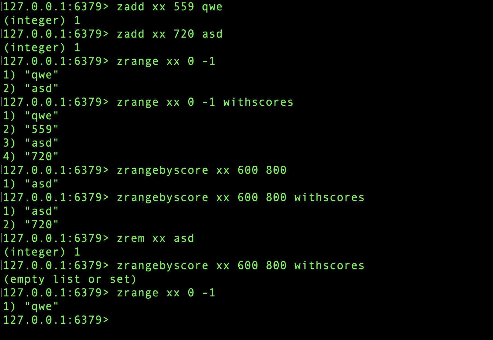

#简介

Redis 是速度非常快的非关系型（NoSQL）内存键值数据库，可以存储键和五种不同类型的值之间的映射。

键的类型只能为字符串，值支持五种数据类型：字符串、列表、集合、散列表、有序集合。

Redis 支持很多特性，例如将内存中的数据持久化到硬盘中，使用复制来扩展读性能，使用分片来扩展写性能。

# 数据类型

| 数据类型 |      可以存储的值      |                             操作                             |
| :------: | :--------------------: | :----------------------------------------------------------: |
|  STRING  | 字符串、整数或者浮点数 | 对整个字符串或者字符串的其中一部分执行操作，对整数和浮点数执行自增或者自减操作。 |
|   LIST   |          列表          | 从两端压入或者弹出元素，对单个或者多个元素进行修剪，只保留一个范围内的元素。 |
|   SET    |        无序集合        | 添加、获取、移除单个元素，检查一个元素是否存在于集合中， 计算交集、并集、差集，从集合里面随机获取元素。 |
|   HASH   | 包含键值对的无序散列表 | 添加、获取、移除单个键值对，获取所有键值对。检查某个键是否存在。 |
|   ZSET   |        有序集合        | 添加、获取、删除元素，根据分值范围或者成员来获取元素，计算一个键的排名。 |

##STRING

最简单的k-v对

##LIST

1. 通过key名称和一个index的值或者一个范围来获取value。
2. 使用rpush、rpop、lpush、lpop来对这个key的队列进行管理。
3. 使用 0 -1的范围可以获取整个队列。
4. 可以存在重复的元素。

##SET

1. 可以在set中添加删除。
2. 判断一个字符是不是属于这个set

##HASH

类似于HashTable：

1. 如上图，一个key 可以拥有多个 field - value 的集合。
2. 可以通过语句操作这些field - value的集合。
3. 可以分别获取所有 field 和 value。

n

##ZSET

类似于TreeMap

1. 使用 score - member 保存数据。但是在这里，score一定是分数，也就是数字。
2. 由于 score 是数字，所以可以根据 score 的值来读取 member 的值。
3. 可以通过范围

