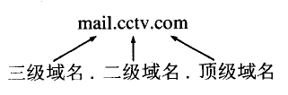

# 网络分层

osi七层：

应用层、表示层、会话层、传输层、网络层、链路、物理层

TCP/IP四层：

应用层、传输层、网络层、物理链路层

五层结构：

应用层、传输层、网络层、链路、物理层

# 应用层

|       应用       | 应用层协议 | 端口号  | 传输层协议 |            备注             |
| :--------------: | :--------: | :-----: | :--------: | :-------------------------: |
|     域名解析     |    DNS     |   53    |  UDP/TCP   | 长度超过 512 字节时使用 TCP |
| 动态主机配置协议 |    DHCP    |  67/68  |    UDP     |                             |
| 简单网络管理协议 |    SNMP    | 161/162 |    UDP     |                             |
|   文件传送协议   |    FTP     |  20/21  |    TCP     |  控制连接 21，数据连接 20   |
|   远程终端协议   |   TELNET   |   23    |    TCP     |                             |
|  超文本传送协议  |    HTTP    |   80    |    TCP     |                             |
| 简单邮件传送协议 |    SMTP    |   25    |    TCP     |                             |
|   邮件读取协议   |    POP3    |   110   |    TCP     |                             |
| 网际报文存取协议 |    IMAP    |   143   |    TCP     |                             |

# DNS

域名系统DNS(Domain Name System)是因特网使用的命名系统，用来把便于人们使用的机器名字转换成为IP地址。域名系统其实就是名字系统。

DNS的左右就是将 `www.xxx.cn`这样的字符串解析成IP地址。

例如cctv的邮件域名：

从语法上讲，每一个域名都是有标号(label)序列组成，而各标号之间用点(小数点)隔开。

域名服务器：

递归查询和迭代查询：

迭代查询的特点：当服务器收到客户端发出的迭代查询请求报文时，要么给出所要查询的IP地址，要么告诉本地服务器：“你下一步应当向哪一个服务器进行查询”。

递归查询就是：如果客户端所询问的服务器不知道被查询的域名的IP地址，那么服务器就以客户端的身份，向其它服务器继续发出查询请求报文(即替客户端继续查询)，而不是让客户端自己进行下一步查询。

通常主机向本地域名服务器发出的请求是递归查询，本地域名服务器在不知道请求的域名的情况下，向上级发出的请求是迭代查询，也就是图b。

以输入了`www.baidu.com`为例子

1. 输入`www.baidu.com`。
2. 浏览器向本地DNS服务器发送查询`www.baidu.com`的请求。
3. 本地DNS向根服务器查询`.com`的地址。
4. 本地DNS向`.com`服务器查询`baidu.com`的地址。
5. 本地DNS向`baidu.com`服务器查询`www.baidu.com`的地址。
6. 本地DNS将`www.baidu.com`的IP地址返回给浏览器。
7. 得到目标域名的IP地址之后，和服务器建立一个http连接。

通常为了提高DNS查询效率，并减轻服务器的负荷和减少因特网上的DNS查询报文数量，在域名服务器中广泛使用了高速缓存，用来存放最近查询过的域名以及从何处获得域名映射信息的记录。

例如，在上面的查询过程中，如果在`www.baidu.com`的主机上不久前已经有用户查询过`www.baidu.com`的IP地址，那么本地域名服务器就不必向根域名服务器重新查询`www.baidu.com`的IP地址，而是直接把告诉缓存中存放的上次查询结果(即`www.baidu.com`的IP地址)告诉用户。

由于名字到地址的绑定并不经常改变，为保持告诉缓存中的内容正确，域名服务器应为每项内容设置计时器并处理超过合理时间的项(例如每个项目两天)。当域名服务器已从缓存中删去某项信息后又被请求查询该项信息，就必须重新到授权管理该项的域名服务器绑定信息。当权限服务器回答一个查询请求时，在响应中都指明绑定有效存在的时间值。增加此时间值可减少网络开销，而减少此时间值可提高域名解析的正确性。

# Cookie和Session

## cookie

在网站中，http请求是无状态的。也就是说即使第一次和服务器连接后并且登录成功后，第二次请求服务器依然不能知道当前请求是哪个用户。cookie的出现就是为了解决这个问题，第一次登录后服务器返回一些数据（cookie）给浏览器，然后浏览器保存在本地，当该用户发送第二次请求的时候，就会自动的把上次请求存储的cookie数据自动的携带给服务器，服务器通过浏览器携带的数据就能判断当前用户是哪个了。cookie存储的数据量有限，不同的浏览器有不同的存储大小，但一般不超过4KB。因此使用cookie只能存储一些小量的数据。

## session

session和cookie的作用有点类似，都是为了存储用户相关的信息。不同的是，cookie是存储在本地浏览器，而session存储在服务器。存储在服务器的数据会更加的安全，不容易被窃取。但存储在服务器也有一定的弊端，就是会占用服务器的资源，但现在服务器已经发展至今，一些session信息还是绰绰有余的。

## cookie和session

web开发发展至今，cookie和session的使用已经出现了一些非常成熟的方案。在如今的市场或者企业里，一般有两种存储方式：

1. 存储在服务端：通过cookie存储一个session_id，然后具体的数据则是保存在session中。如果用户已经登录，则服务器会在cookie中保存一个session_id，下次再次请求的时候，会把该session_id携带上来，服务器根据session_id在session库中获取用户的session数据。就能知道该用户到底是谁，以及之前保存的一些状态信息。这种专业术语叫做server side session。
2. 存在客户端：将session数据加密，然后存储在cookie中。这种专业术语叫做client side session。

## 区别

1. cookie和session存储的位置不同。cookie存储在客户端，session存储在服务端。
2. cookie的安全性不高，可以在客户端伪造。

## 使用流程

*假设一开始浏览器端不存在cookie*

1. 浏览器第一次向服务器发起HTTP请求
   1. 服务器检查到这个HTTP请求没有附带有session_id的cookie
   2. 在服务器端生成一个session
   3. 将这个session_id通过HTTP响应中的cookie设置到浏览器中
2. 在cookie和session的超时时间内，再次发起HTTP请求
   1. 在请求的时候附带上含有session_id的cookie
   2. 服务器识别到了这个cookie中的session
   3. 在服务器中查找这个session_id对应的session
   4. 通过这个session保存的上一次访问服务留下的信息，可以识别出请求的用户信息

# HTTPS

## HTTP的安全性问题

1. 使用明文通信
2. 不验证通信方身份
3. 无法验证报文的完整性

## HTTPS的解决方式

HTTPS是指的SSL和TCP组合访问的方式，实现安全性。通过使用SSL，HTTPS实现了加密、认证、完整性验证的保护。

# HTTP X

## HTTP 1.0 和 1.1

1. 长连接
   - 只要是客户端或者是服务端任何一段没有提出关闭TCP连接，那么就一直保持连接
2. 节约带宽
   - 事先发送一个只含有头的请求，如果因为权限问题没有能访问，就返回响应码400
3. HOST域
   - 一个IP地址可以对应多个域名，一台服务器只有一个ip，上面可以放成千上万个网站
   - 当对这些网站的请求到来时，服务器根据HOST这一行中的值来确定本次请求的是哪个具体的网站
4. 管线化
   - 客户端可以同时发送多个HTTP请求，而不用一个个等待响应
5. 断点续传
   - 客户端记录下当前的下载进度，并在需要续传时通知服务器本次需要下载的内容片断

## HTTP 1.1 和 2.0

1. 多路复用
   - 使用一个HTTP连接实现请求多个响应
2. 二进制分帧
   - 采用二进制文件格式，而不是文本文件格式
3. 首部压缩
   - 压缩报头，降低开销
4. 服务器推送
   - 服务器将响应主动推到客户端的缓存中

