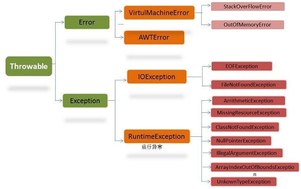

# 面向对象

Java面向对象的三大特性：封装、继承、多态。

## 类和对象

类是Java中的一个抽象的定义，表示一类具有相同属性和功能的一种分类。对象是一个种类的实例对象。

## 接口和抽象类

### 接口

#### 域

1. 接口中的域只能是public static final这样的 公共-静态-常量 的属性。
2. 在接口中，这样的属性是默认的，不需要额外声明，但是不能声明成别的类型。
3. 并且，在接口中的域只能在实现这个接口中的类中使用，而且不允许被修改。
4. 按照代码规则，`final`常量应该使用全部的大写字母表示。

```java
public static final int FIELD = 100;
```

#### 方法

1. 只能是public abstract这样的 公共-抽象 的方法。
2. 接口中的方法不允许有方法体。只能有方法的声明，不能进行实现。
3. 同样的，这样的属性是默认的，不需要额外声明，但是不能声明成别的类型。

### 抽象类

#### 域

域和通常的类是没有区别的。抽象类中的域的声明四种访问控制均可以使用。

#### 方法

抽象类中方法，可以是没有方法体的抽象方法，也可以是一般的普通方法。

##### 抽象方法

抽象方法的访问控制不能是private，其余的三种都是可以的。

不可以使用static修饰。

不可以有方法体。

在非抽象继承类中，需要实现这些抽象方法。

##### 一般方法

抽象类中一般方法和一般类中的方法一样。

### 接口和抽象类的异同

#### 相同点

1. 均可以存在没有方法体的抽象方法。
2. 都不能被直接实现，即都不能被直接实例化。

#### 不同点

1. 接口中的域只能是public static final，而抽象类中的域没有限制。
2. 接口中的抽象方法只能是public。而抽象类中的抽象方法除了不能是private其余均可。
3. 接口中除了抽象方法以外不能存在其他的方法，但是抽象类中可以存在一般的方法。
4. 一个类可以实现多个接口，但是只能实现一个抽象类。

## 重写和重载

重写又叫做覆写。

重写和重载是Java实现多态的重要手段。

### 多态

简单来说，就是同一个方法名在不同的时候有不同的动作。

### 重写

当使用多态方式调用方法时，首先检查父类中是否有该方法，如果没有，则编译错误；如果有，再去调用子类的同名方法。

在子类中对父类的方法进行覆盖，那么在子类中调用到的方法，就来自于子类中的复写后的方法，而不是父类中的方法。
1. 在父类中private的方法不能被重写。
2. 重写的方法名、返回值、参数表父子均应该一致。
3. 子类中的方法的可访问范围应该大于或等于父类的呗复写方法。

```java
public class Main extends Test {

    @Override
    public int func(int a, int b) {
        return a * b;
    }

    public static void main(String[] args) {
        Test main = new Main();
        System.out.println(main.func(2, 3));
    }
}


class Test {
    public int func(int a, int b) {
        return a + b;
    }
}
```

```java
6
```

### 重载

重载是指的在同一个类中，同一个类中方法名相同的方法但是参数表不同的方法，会根据传入的参数的类型自动匹配合适的方法来执行。如果没有对应的方法，则会错误。

返回值类型和方法的可访问范围不能作为区分两个方法的标志，只有：

1. 参数表里面对应参数的类型不相同
2. 参数表里面参数的个数不相同
3. 参数表里面参数的个数和对应参数的类型均不同

满足以上三种条件之一，才以为这这两个方法是重载。也就是说，参数的类型如果没有达到以上的条件，方法名却相同的话，那么编译器报错。

# 修饰符

## 访问权限修饰符

这四个是表示访问权限修饰符：

|                   | 当前类 | 当前包 | 子类 | 其他包 |
| :---------------: | :----: | :----: | :--: | :----: |
|      public       |   ✅    |   ✅    |  ✅   |   ✅    |
|     protected     |   ✅    |   ✅    |  ✅   |   ❌    |
| (package-private) |   ✅    |   ✅    |  ❌   |   ❌    |
|      private      |   ✅    |   ❌    |  ❌   |   ❌    |

## final修饰符

final可以修饰数据、对象、类和方法。

1. 修饰变量：将这个变量变成了一个常量。即，量的大小不可更改。
2. 修饰引用数据类型：那么这个它的的地址不可改变，但是地址内存放的内容可以改变。 
3. 修饰类：那么这个类被设置成不可被继承的类，即其他类无法extends这个类。
4. 修饰方法：这个方法在子类中无法被覆写。

## static修饰符

static的字面意思是静态的的意思，static可以用来修饰变量、对象、方法：

1. static修饰变量的时候，表示这个变量被这个类的所有对象共用。
2. static修饰对象的时候，表示这个变量被这个类的所有对象共用。
3. static修饰方法的时候，表示这个方式是类级别的方法，不能在其中调用实例方法或者是实例变量。只能使用使用static标记的方法或变量，也可以使用传入的变量。

```java
/**
 * @author thisxzj
 */
public class Main {

    public static Object object = "xxx";

    public static final StringBuilder sb = new StringBuilder("Hello ");

}

class Test {
    public static void main(String[] args) {
        System.out.println(Main.object);
        Main.sb.append("World!");
        System.out.println(Main.sb.toString());
    }
}
```

```java
xxx
Hello World!

Process finished with exit code 0
```

# this & super

this相关的相关的三种使用：

1. 使用 this.field 表示使用这个类中的一般域(非静态域)。
2. 使用 this.method() 表示调用实例方法。
3. 使用 this(param..) 表示调用这个类的构造方法。

super相关的也有三种使用：

1. 使用 super.field 表示使用这个类的父类中的一般域(非静态域)。
2. 使用 super.method(param..) 表示调用父类的实例方法。
3. 使用 super(param..) 表示调用父类的构造方法，只能存在于子类的构造方法的第一行。
# 装箱和拆箱

装箱是Java基本类型的对应类型，通常和基本类型可以无缝衔接。

- 装箱：将基本类型用它们对应的引用类型包装起来。
- 拆箱：将包装类型转换为基本数据类型。

## 使用的资源

以int 和 Integer为例子，Integer有三种创建方式：

1. ```java
   int num = 127;		//129
   Integer i1 = num;
   Integer i2 = Integer.valueOf(num);
   Integer i3 = new Integer(num);
   ```

在Integer包装类的缓存范围 [128,-127] 之内，i1 和 i2 是使用的同一份资源。i3由于新建的方式是new，则不会相同。在缓存范围外，他们则均不相同。但是无论是何种情况，使用equals他们均相等。

原因在于，在缓存范围内，使用valueOf的构建方式，会直接引用基本数据类型的值。所以使用相等判断符号得到的地址是相同的。但是超过了缓存范围，那么就是另外应用对象了。由于equals的比较方式永远是解析对象的值，而不是比较地址，他们值的大小相同，那么就是相同。

同样的，其他的基本类型也有缓存范围：

- boolean： true 、false
- byte：-128 ～ 127
- short： -128 ～ 127
- int： -128 ～ 127
- char：0 ～ 127 对应的char

# 异常处理



在 Java 中，所有的异常都有一个共同的祖先java.lang包中的 Throwable类。

Throwable： 有两个重要的子类：Exception(异常)和 Error(错误) ，二者都是 Java 异常处理的重要子类，各自都包含大量子类。

1. Error（错误）:是程序无法处理的错误，表示运行应用程序中较严重问题。大多数错误与代码编写者执行的操作无关，而表示代码运行时 JVM（Java 虚拟机）出现的问题。在 Java中，错误通过Error的子类描述。

2. Exception(异常):是程序本身可以处理的异常。有一个重要的子类RuntimeException。这个异常由Java虚拟机抛出。

   - NullPointerException（要访问的变量没有引用任何对象时，抛出该异常）
   - ArithmeticException（算术运算异常，一个整数除以0时，抛出该异常）和
   - ArrayIndexOutOfBoundsException （下标越界异常）。

## 区别

异常能被程序本身可以处理，错误是无法处理。

## 处理方式

Throwable类常用方法

1. public string getMessage():返回异常发生时的详细信息
2. public string toString():返回异常发生时的简要描述
3. public string getLocalizedMessage():返回异常对象的本地化信息。
   - 使用Throwable的子类覆盖这个方法，可以声称本地化信息。
   - 如果子类没有覆盖该方法，则该方法返回的信息与getMessage()返回的结果相同。
4. public void printStackTrace():在控制台上打印Throwable对象封装的异常信息。

# hashCode 与 equals

## hashCode方法

hashCode() 的作用是获取哈希码，也称为散列码。它实际上是返回一个int整数，作为哈希码。这个哈希码的作用是确定该对象在哈希表中的索引位置。

hashCode() 定义在JDK的Object.java中，这就意味着任何类都包含有hashCode() 函数。

## equals方法

:它的作用是判断两个对象是否相等。但它一般有两种使用情况：

- 情况1：类没有覆盖 equals() 方法。则通过 equals() 比较该类的两个对象时，等价于通过“==”比较这两个对象。
- 情况2：类覆盖了 equals() 方法。一般，我们都覆盖 equals() 方法来两个对象的内容相等；若它们的内容相等，则返回 true (即，认为这两个对象相等)。

## 二者关系

hashCode() 返回散列值，而 equals() 是用来判断两个对象是否等价。等价的两个对象散列值一定相同，但是散列值相同的两个对象不一定等价。

在覆盖 equals() 方法时应当总是覆盖 hashCode() 方法，保证等价的两个对象散列值也相等。


　1. Java中的泛型是什么 ? 使用泛型的好处是什么?

　　这是在各种Java泛型面试中，一开场你就会被问到的问题中的一个，主要集中在初级和中级面试中。那些拥有Java1.4或更早版本的开发背景的人都知道，在集合中存储对象并在使用前进行类型转换是多么的不方便。泛型防止了那种情况的发生。它提供了编译期的类型安全，确保你只能把正确类型的对象放入集合中，避免了在运行时出现ClassCastException。

　　2. Java的泛型是如何工作的 ? 什么是类型擦除 ?

　　这是一道更好的泛型面试题。泛型是通过类型擦除来实现的，编译器在编译时擦除了所有类型相关的信息，所以在运行时不存在任何类型相关的信息。例如List<String>在运行时仅用一个List来表示。这样做的目的，是确保能和Java 5之前的版本开发二进制类库进行兼容。你无法在运行时访问到类型参数，因为编译器已经把泛型类型转换成了原始类型。根据你对这个泛型问题的回答情况，你会得到一些后续提问，比如为什么泛型是由类型擦除来实现的或者给你展示一些会导致编译器出错的错误泛型代码。请阅读我的Java中泛型是如何工作的来了解更多信息。

　　3. 什么是泛型中的限定通配符和非限定通配符 ?

　　这是另一个非常流行的Java泛型面试题。限定通配符对类型进行了限制。有两种限定通配符，一种是<? extends T>它通过确保类型必须是T的子类来设定类型的上界，另一种是<? super T>它通过确保类型必须是T的父类来设定类型的下界。泛型类型必须用限定内的类型来进行初始化，否则会导致编译错误。另一方面<?>表示了非限定通配符，因为<?>可以用任意类型来替代。更多信息请参阅我的文章泛型中限定通配符和非限定通配符之间的区别。

　　4. List<? extends T>和List <? super T>之间有什么区别 ?

　　这和上一个面试题有联系，有时面试官会用这个问题来评估你对泛型的理解，而不是直接问你什么是限定通配符和非限定通配符。这两个List的声明都是限定通配符的例子，List<? extends T>可以接受任何继承自T的类型的List，而List<? super T>可以接受任何T的父类构成的List。例如List<? extends Number>可以接受List<Integer>或List<Float>。在本段出现的连接中可以找到更多信息。

　　5. 如何编写一个泛型方法，让它能接受泛型参数并返回泛型类型?

　　编写泛型方法并不困难，你需要用泛型类型来替代原始类型，比如使用T, E or K,V等被广泛认可的类型占位符。泛型方法的例子请参阅Java集合类框架。最简单的情况下，一个泛型方法可能会像这样:

​      public V put(K key, V value) {

​              return cache.put(key, value);

​      }

　  6. Java中如何使用泛型编写带有参数的类?

　　这是上一道面试题的延伸。面试官可能会要求你用泛型编写一个类型安全的类，而不是编写一个泛型方法。关键仍然是使用泛型类型来代替原始类型，而且要使用JDK中采用的标准占位符。

　　7. 编写一段泛型程序来实现LRU缓存?

　　对于喜欢Java编程的人来说这相当于是一次练习。给你个提示，LinkedHashMap可以用来实现固定大小的LRU缓存，当LRU缓存已经满了的时候，它会把最老的键值对移出缓存。LinkedHashMap提供了一个称为removeEldestEntry()的方法，该方法会被put()和putAll()调用来删除最老的键值对。当然，如果你已经编写了一个可运行的JUnit测试，你也可以随意编写你自己的实现代码。

　　8. 你可以把List<String>传递给一个接受List<Object>参数的方法吗？

　　对任何一个不太熟悉泛型的人来说，这个Java泛型题目看起来令人疑惑，因为乍看起来String是一种Object，所以List<String>应当可以用在需要List<Object>的地方，但是事实并非如此。真这样做的话会导致编译错误。如果你再深一步考虑，你会发现Java这样做是有意义的，因为List<Object>可以存储任何类型的对象包括String, Integer等等，而List<String>却只能用来存储Strings。　

```java
List<Object> objectList;
List<String> stringList;
objectList = stringList;  //compilation error incompatible types
```

 　9. Array中可以用泛型吗?

　　这可能是Java泛型面试题中最简单的一个了，当然前提是你要知道Array事实上并不支持泛型，这也是为什么Joshua Bloch在Effective Java一书中建议使用List来代替Array，因为List可以提供编译期的类型安全保证，而Array却不能。

　　10. 如何阻止Java中的类型未检查的警告?

　　如果你把泛型和原始类型混合起来使用，例如下列代码，Java 5的javac编译器会产生类型未检查的警告，例如　　

​       List<String> rawList = new ArrayList()